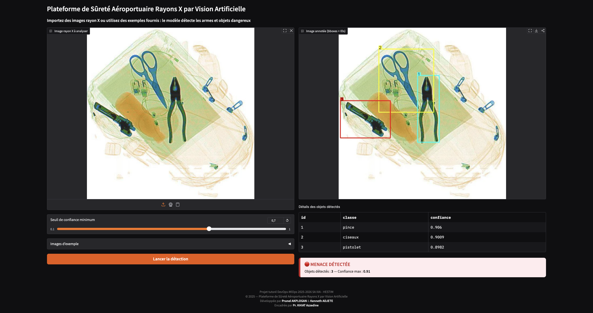

# Détection d'objets dangereux dans les bagages à rayons X avec YOLOv11m – Pipeline DevOps / MLOps – Vision par ordinateur


Projet tutoré visant la mise en place d’un **pipeline DevOps–MLOps complet** pour la détection d’objets dangereux (armes, couteaux, outils) dans des images de bagages scannés aux rayons X.

Le projet combine :

- **MLOps** : entraînement, évaluation et sauvegarde d’un modèle YOLOv11m fine-tuné sur le dataset **SIXray** (version Roboflow),
- **DevOps** : interface web **Gradio**, conteneurisation Docker, pipeline CI/CD GitHub Actions, déploiement automatisé sur **AWS EC2**.

---

## 1️⃣ Contexte & objectifs

Dans les systèmes de sécurité aéroportuaire, la détection d’armes dans les bagages est une tâche critique.  
Aujourd’hui, l’analyse des images rayons X repose largement sur des opérateurs humains, ce qui peut entraîner :

- de la fatigue,
- des erreurs de détection,
- des temps de traitement importants.

**Objectif du projet :**

> Entraîner un modèle de vision par ordinateur (YOLOv11m) pour détecter automatiquement des objets dangereux dans des images rayons X, puis l’exposer via une interfce web gradio conteneurisée et déployée dans le cloud (AWS EC2), via un pipeline CI/CD.

---

## 2️⃣ Dataset

- **Nom** : SIXray (version Roboflow)
- **Type** : images rayons X de bagages
- **Annotations** : bounding boxes
- **Tâche** : détection d’objets
- **Format** : YOLO (`train / valid / test + data.yaml`)

Téléchargement via Roboflow dans le notebook :

```python
from roboflow import Roboflow

rf = Roboflow(api_key="VOTRE_API_KEY")
project = rf.workspace("siewchinyip-outlook-my").project("sixray")
dataset = project.version(4).download("yolov8")  # compatible YOLOv11
```

Les scripts d’entraînement, d’EDA et d’évaluation se trouvent dans :

```text
notebooks/Sixray_yolov11_dev.ipynb
```

---

## 3️⃣ Architecture globale (DevOps / MLOps)

Le pipeline global se décompose en plusieurs étapes.

### 3.1 MLOps – Entraînement du modèle

1. Préparation des données (Roboflow → format YOLO).
2. Analyse exploratoire (distribution des classes, exemples d’images, complexité des données).
3. Entraînement de YOLOv11m (fine-tuning) sur Google Colab.
4. Visualisation des courbes d’apprentissage (loss, mAP50, mAP50-95).
5. Évaluation du modèle (mAP, précision, rappel, matrice de confusion).
6. Sauvegarde du meilleur modèle : `models/yolo11_sixray_best.pt`.

### 3.2 Application – Interface Web Gradio

L’application est une **interface web interactive Gradio** permettant :

- le téléversement d’images rayons X,
- l’utilisation d’images d’exemple,
- l’affichage des bounding boxes détectées,
- un panneau d’état (vert / orange / rouge),
- une alerte sonore en cas de menace détectée.

Fichier principal :

```text
api/app.py
```

### 3.3 DevOps – Conteneurisation Docker

- Dockerfile dans `docker/Dockerfile`
- Image basée sur `python:3.11-slim`
- Installation des requirements
- Copie du modèle et de l’API dans l’image
- Exposition du port **7865** (Gradio)

### 3.4 CI – GitHub Actions

- Fichier `.github/workflows/ci-cd-workflow.yml`
- Déclenchement automatique sur `push` / `pull_request` sur `main`
- Étapes :
  - Récupération du code
  - Installation de Python et des dépendances
  - Exécution des tests unitaires (`pytest`)
  - Build de l’image Docker pour vérifier que le Dockerfile est valide

### 3.5 CD – Déploiement sur AWS EC2

- Instance EC2 (Ubuntu) avec Docker installé
- Script `deploy.sh` présent sur l’EC2 pour :
  - récupérer la dernière version du code,
  - arrêter l’ancien conteneur,
  - construire l’image Docker,
  - lancer la nouvelle version de l'app.
- Un job **`cd`** dans GitHub Actions se connecte en **SSH** à l’EC2 et exécute `deploy.sh` après la réussite des tests et du build Docker.

Ainsi, le pipeline complète la boucle **CI/CD** de manière entièrement automatisée :  
**push/merge sur GitHub → tests → build → déploiement sur EC2**.

---
## 🧪 Suivi des workflows CI/CD (GitHub Actions)

Les résultats d’exécution du pipeline **CI/CD** sont consultables directement dans l’onglet **Actions** du dépôt GitHub.

Cet onglet permet :
- de visualiser l’historique des workflows,
- de vérifier le statut des jobs (succès / échec),
- d’accéder aux logs détaillés de chaque étape :
  - installation des dépendances,
  - exécution des tests,
  - build de l’image Docker,
  - déploiement sur AWS EC2.
---

## 4️⃣ Structure du projet

```text
xray-treat-detector/
├── api/                         # Application (Gradio / inference)
│   └── app.py
├── models/                      # Modèle YOLOv11 fine-tuné
│   └── yolo11_sixray_best.pt
├── samples_images/              # Images d’exemple pour la démo
│   ├── 1.jpg
│   ├── 2.jpg
│   ├── 3.jpg
│   └── 4.jpg
├── docker/                      # Conteneurisation
│   └── Dockerfile
├── scripts/                     # Scripts utilitaires (CD, maintenance)
│   └── deploy.sh
├── tests/                       # Tests unitaires / CI
├── notebooks/                   # R&D / entraînement / EDA
│   └── Sixray_yolov11_dev.ipynb
├── docs/                        # Figures / ressources pour rapport
├── docker-compose.yml           # Orchestration (build + run)
├── requirements.txt
└── README.md
```

---

## 5️⃣ Installation & exécution locale

### 5.1 Prérequis

- Python 3.10+
- `pip`
- (Optionnel) Docker

### 5.2 Installation (sans Docker)

```bash
git clone https://github.com/Lordnel/xray-treat-detector.git
cd xray-treat-detector

# Installation des dépendances
pip install -r requirements.txt
```

### 5.3 Lancement de l’application gradio

```bash
python api/app.py
```
Interface : http://localhost:7865

---

## 6️⃣ Utilisation avec Docker

### 6.1 Build de l’image

```bash
docker compose build
```

### 6.2 Lancer le conteneur

```bash
docker compose up -d
```

Interface : http://localhost:8000

---

## 🔗 Accès à l’application déployée (AWS EC2)

L’application est déployée sur une instance **AWS EC2** accessible à l’adresse :

```text
http://34.233.76.37:8000
```

⚠️ **Remarque importante**  
L’instance EC2 **n’est pas active en continu** afin de limiter les coûts cloud.

> Pour une démonstration en ligne, merci de **contacter les auteurs du projet** afin que l’instance soit lancée manuellement.

---

## 📄 Documentation & ressources expérimentales

Le dossier **`docs/`** contient :
- le **rapport complet du projet tutoré**,
- les **courbes de métriques** (loss, mAP, précision, rappel),
- les figures et visualisations utilisées dans l’analyse,
- des captures de l’interface Gradio.

Ces éléments assurent la **traçabilité des résultats** et la **reproductibilité expérimentale**.

---

## Conclusion

Ce projet illustre un cas d’usage complet de **vision par ordinateur** appliquée à la **sécurité aéroportuaire**, depuis :

- l’entraînement d’un modèle YOLOv11m sur un dataset complexe (SIXray),
- jusqu’à son déploiement dans un pipeline **DevOps–MLOps** reproductible sur **AWS EC2**.

Il peut servir de base à des extensions plus avancées (monitoring, gestion des versions de modèles, détection temps réel, amélioration de la robustesse du déploiement, etc.).

---

> Réalisé par Prunel AKPLOGAN & Kenneth ADJETE
> Encadré par Pr. Azzedine KHIAT
